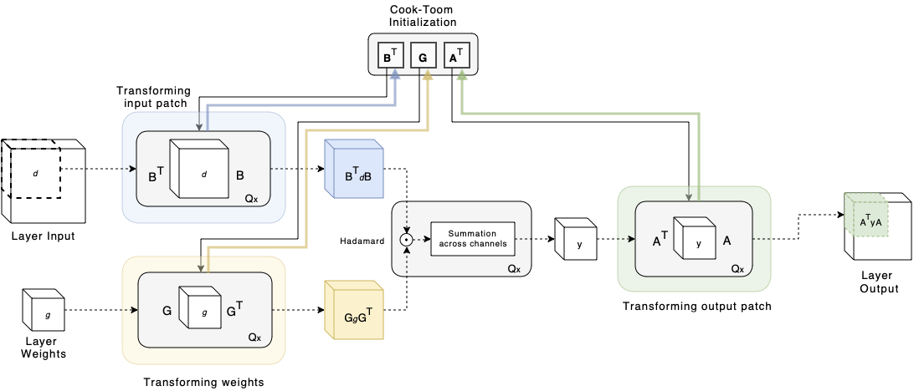

# Searching for Winograd-aware Quantized Networks


Searching for Winograd-aware Quantized Networks (Fernandez-Marques *et al.*, MLSys 2020): [https://arxiv.org/abs/2002.10711](https://arxiv.org/abs/2002.10711)





## Environment setup

Here we'll assume a [Miniconda](https://docs.conda.io/en/latest/miniconda.html) installation is reachable from a standard bash/zsh terminal. These are the steps to setup the environment:

```sh
# Create environment:
$ conda create -n PyTorchWA python=3.7 -y

# Activate it:
$ source activate PyTorchWA

# Install Pytorch (CPU or CPU+GPU):
$ conda install pytorch==1.3.1 torchvision -c pytorch -y # CPU only 
$ conda install pytorch==1.3.1 torchvision cudatoolkit=10.1 -c pytorch -y # w/ GPU support

# Install other dependencies:
$ pip install -r requirements.txt
```

## The model

This repo implements a slightly modified ResNet18 architecture for CIFAR-10/100. These modifications are applied for all experiments regardless of which type of convolutional layer (i.e. normal or Winograd-aware) is chosen. The main differences w.r.t. the default ResNet18 are:

1. We've reduced the number of output channels of the input convolutional layer from 64 to 32.
2. All 3x3 convolutions w/ stride=2 have been replaced by a maxpool(2x2) followed by a 3x3 conv w/ stride=1. This is needed since there's no a direct Winograd equivalent of stride=2 convolution.


## Train

There are **three main modes** to define your training: with standard convolutional layers (using flag `--use_normal_conv`); with Winograd-aware (WA) layers (flag `--static`) using default Cook-Toom transforms; or with Winograd-aware layers and **learnable** transforms (flag `--flex`). You can train a ResNet18 network by executing:

```bash
$ python train.py <mode> # --use_normal_conv or --static or --flex
```

In addition to the basic call above, there are a few optional input arguments: by default, training will happen in FP32, you can enable quantization with flag `--Q` and specify a particular bit-width with `--bits` followed by an integer (default is 8). In addition, WA layers can be implemented using different tile sizes. This parameter can be modified using flag `--F` followed by an integer (default is 4). Currently, only `F(2x2, 3x3)`, `F(4x4,3x3)` and `F(6x6, 3x3)` are supported. With flag `--mult` you can specify the width multiplier for the convolutional layers. This should be a value `(0:1]` (default is 0.5). When `mult=1.0` the model trained is the full ResNet18 model. Note that training WA networks requires subtantially more memory than when using stanadar convolutional layers. Therefore, for high `--mult` values, you'll need a large GPU.

Here are a few examples:

```bash
# train with standard convolutions, 16 bits and 120 epochs
python train.py --use_normal_conv --Q --bits 16 --epochs 120

# train a WA model with static transforms using F(2x2, 3x3) and using CPU only
python train.py --static --F 2 --use_cpu

# train a WA model with learnable transforms, F(4x4, 3x3), 8 bits and width multiplier 0.25 
python train.py --flex --F 4 --Q --mult 0.25
```

Launching the training will print a table summarising how your model has been configured:

```
TRAINABLE VARIABLES INFORMATION - arch: ResNet18LikeF4 
+-----------------+---------------------+-------------------+------------+------+------+---------+---------+
|     VarName     |     Param Shape     |    Input Shape    |  Winograd  | Flex | bits | Size(k) | Size(%) |
+-----------------+---------------------+-------------------+------------+------+------+---------+---------+
|      Conv2d     |    [32, 3, 3, 3]    |        None       |     -      |  -   |  FP  |   0.86  |   0.0   |
| Conv2d_winograd |  [32, 32, 1, 3, 3]  | ['n', 32, 32, 32] | F(4x4,3x3) | True |  8   |   9.22  |   0.3   |
| Conv2d_winograd |  [32, 32, 1, 3, 3]  | ['n', 32, 32, 32] | F(4x4,3x3) | True |  8   |   9.22  |   0.3   |
| Conv2d_winograd |  [32, 32, 1, 3, 3]  | ['n', 32, 32, 32] | F(4x4,3x3) | True |  8   |   9.22  |   0.3   |
| Conv2d_winograd |  [32, 32, 1, 3, 3]  | ['n', 32, 32, 32] | F(4x4,3x3) | True |  8   |   9.22  |   0.3   |
| Conv2d_winograd |  [64, 32, 1, 3, 3]  | ['n', 32, 16, 16] | F(4x4,3x3) | True |  8   |  18.43  |   0.7   |
| Conv2d_winograd |  [64, 64, 1, 3, 3]  | ['n', 64, 16, 16] | F(4x4,3x3) | True |  8   |  36.86  |   1.3   |
|      Conv2d     |    [64, 32, 1, 1]   | ['n', 32, 16, 16] |     -      |  -   |  8   |   2.05  |   0.1   |
| Conv2d_winograd |  [64, 64, 1, 3, 3]  | ['n', 64, 16, 16] | F(4x4,3x3) | True |  8   |  36.86  |   1.3   |
| Conv2d_winograd |  [64, 64, 1, 3, 3]  | ['n', 64, 16, 16] | F(4x4,3x3) | True |  8   |  36.86  |   1.3   |
| Conv2d_winograd |  [128, 64, 1, 3, 3] |  ['n', 64, 8, 8]  | F(4x4,3x3) | True |  8   |  73.73  |   2.6   |
| Conv2d_winograd | [128, 128, 1, 3, 3] |  ['n', 128, 8, 8] | F(4x4,3x3) | True |  8   |  147.46 |   5.3   |
|      Conv2d     |   [128, 64, 1, 1]   |  ['n', 64, 8, 8]  |     -      |  -   |  8   |   8.19  |   0.3   |
| Conv2d_winograd | [128, 128, 1, 3, 3] |  ['n', 128, 8, 8] | F(4x4,3x3) | True |  8   |  147.46 |   5.3   |
| Conv2d_winograd | [128, 128, 1, 3, 3] |  ['n', 128, 8, 8] | F(4x4,3x3) | True |  8   |  147.46 |   5.3   |
| Conv2d_winograd | [256, 128, 1, 3, 3] |  ['n', 128, 4, 4] | F(4x4,3x3) | True |  8   |  294.91 |   10.6  |
| Conv2d_winograd | [256, 256, 1, 3, 3] |  ['n', 256, 4, 4] | F(4x4,3x3) | True |  8   |  589.82 |   21.1  |
|      Conv2d     |   [256, 128, 1, 1]  |  ['n', 128, 4, 4] |     -      |  -   |  8   |  32.77  |   1.2   |
| Conv2d_winograd | [256, 256, 1, 3, 3] |  ['n', 256, 4, 4] | F(4x4,3x3) | True |  8   |  589.82 |   21.1  |
| Conv2d_winograd | [256, 256, 1, 3, 3] |  ['n', 256, 4, 4] | F(4x4,3x3) | True |  8   |  589.82 |   21.1  |
|      Linear     |      [10, 256]      |        None       |     -      |  -   |  FP  |   2.56  |   0.1   |
+-----------------+---------------------+-------------------+------------+------+------+---------+---------+
Params shown in table size: 2792.800 K params
Total size: 2798.858 K params
Total (trainable) size: 2798.858 K params

Output dir:  experiments/ResNet18LikeF4/Flex/mult_0.5/bits_8/lr_0.001/<currentDateAndTime>
```

## Adapt
Training large WA models can be quite slow and uses quite a significant amount of memory. This is a direct consequency of having to implement all the stages involved in the Winograd convolution (i.e. transform of inputs and weights to the Winograd domain, performing the element-wise multiplication and transforming the output back from the Winograd domain) **and** having to retain the inputs to each `op` in memory in order to backpropagate through the entire process. The most effective way of easing the memory requirements (without having to make major changes to the code) would be to make use of [gradient checkpointing](https://medium.com/tensorflow/fitting-larger-networks-into-memory-583e3c758ff9), which is supported by [PyTorch](https://pytorch.org/docs/stable/checkpoint.html). Here however we'll focus only on how to train WA models faster by means of a simple yet effective technique:

```bash

# First, train the model using standard convolutions (this should be quite fast)
python train.py --use_normal_conv --mult 0.5 --Q --bits 8 --epochs 120

# Second, use the model we just trained to initialize the weights of its WA counterpart.
# Use `--modelDir` to tell where your trained model is, then specify the config params for your WA model
python adapt.py --modelDir <directory where your .pt lives> --flex --F 4 --epochs 20 --Q --bits 8
```

For a successful adaptation, it's important to let the Winograd transformations to evolve during training. The `adapt.py` script can also be used to resume the training of a particular model give a model checkpoint.


## Reference
If you make advantage of Winograd-aware networks in your research, please cite the following in your manuscript:

```
@misc{fern2020searching,
title={Searching for Winograd-aware Quantized Networks},
author={Javier Fernandez-Marques and Paul N. Whatmough and Andrew Mundy and Matthew Mattina},
year={2020},
eprint={2002.10711},
archivePrefix={arXiv},
primaryClass={cs.LG}
}
```